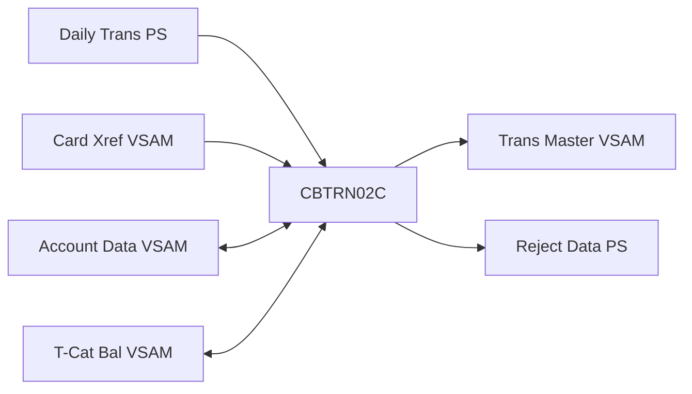

# CardDemo システム 基本設計書（バッチ処理編）

## 1. 概要

本書は、CardDemo システムにおけるバッチ処理の詳細を定義します。JCL によって制御されるジョブサイクル、バッチプログラムの役割、および各処理間でのデータの流れを網羅します。

## 2. バッチサイクル

システムは主に以下の 3 つのバッチサイクルで運用されます。

### 2.1. 日次サイクル (Daily Cycle)

当日のオンライン取引内容をマスタに反映し、整合性をチェックします。

- **主要ジョブ**: `POSTTRAN.jcl`
- **処理フロー**:
  1. 日次取引ファイル (`DALYTRAN`) のバリデーション。
  2. 取引マスタ (`TRANSACT`) への追加。
  3. アカウントマスタ (`ACCTDATA`) の残高更新。
  4. カテゴリ別残高 (`TCATBALF`) の積算。

### 2.2. 月次サイクル (Monthly Cycle)

利息の計算とステートメント（明細書）の発行を行います。

- **主要ジョブ**: `INTCALC.jcl`, `CREASTMT.jcl`
- **処理フロー**:
  1. `TCATBALF` に基づく利息・手数料の計算。
  2. 計算結果を取引レコードとして `TRANSACT` に計上。
  3. 全取引履歴、顧客、アカウント情報を抽出し、明細書 (HTML/Text) を作成。

### 2.3. オンデマンド / 移行サイクル

レポートの随時出力やデータ移行時に実施します。

- **主要機能**: レポート生成 (`CBTRN03C`), インポート・エクスポート (`CBIMPORT`, `CBEXPORT`)

## 3. 機能一覧

| カテゴリ | プログラム ID | 説明 |
| :--- | :--- | :--- |
| 取引更新 | `CBTRN02C`, `CBTRN01C` | 日次取引の反映、リジェクトデータの抽出 |
| 財務計算 | `CBACT04C` | 利息・手数料の計算と計上処理 |
| 帳票出力 | `CBTRN03C`, `CBSTM03A` | 取引レポート、顧客別ステートメントの生成 |
| データ管理 | `CBACT01C`〜`03C`, `CBCUS01C` | アカウント/顧客/カードデータの抽出ダンプ |
| 拠点移行 | `CBEXPORT`, `CBIMPORT` | 他環境へのデータ移行用統合ファイル処理 |

## 4. ジョブフロー（例：取引反映）

<!--

-->

## 5. 共通ユーティリティ

- **CSUTLDTC**: 日付変換・検証（CEEDAYS 呼び出し）
- **COBSWAIT**: 指定時間のプロセス待機
- **CBSTM03B**: 索引ファイルアクセス抽象化（ステートメント生成用）

---
[概要編](file:///Users/inohara/Documents/antigravity-demo/aws-mainframe-modernization-carddemo/docs/BasicDesign.md) | [オンライン処理編](file:///Users/inohara/Documents/antigravity-demo/aws-mainframe-modernization-carddemo/docs/BasicDesign_Online.md) | [データベース設計編](file:///Users/inohara/Documents/antigravity-demo/aws-mainframe-modernization-carddemo/docs/BasicDesign_Database.md) | [関連システムインターフェース編](file:///Users/inohara/Documents/antigravity-demo/aws-mainframe-modernization-carddemo/docs/BasicDesign_Interface.md) | [運用管理編](file:///Users/inohara/Documents/antigravity-demo/aws-mainframe-modernization-carddemo/docs/BasicDesign_Operations.md)
