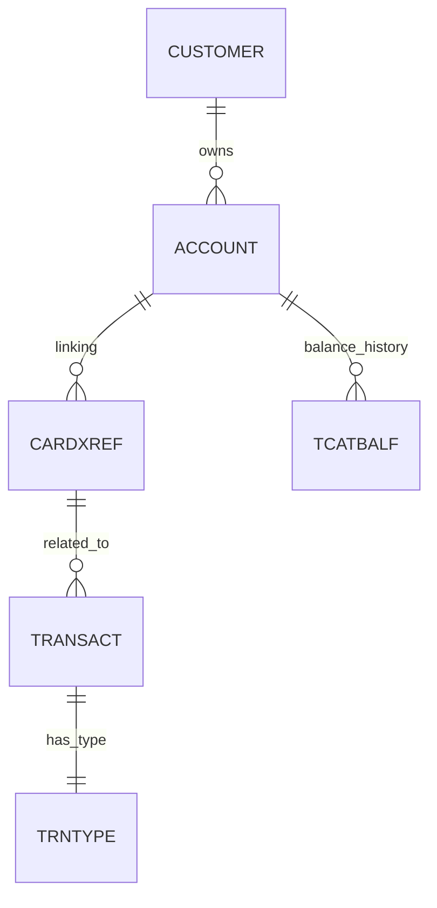

# CardDemo システム 基本設計書（データベース設計編）

## 1. 概要

本書は、CardDemo システムで使用されるデータ構造の詳細を定義します。VSAM (KSDS/RRDS) および DB2 (リレーショナル) の各実体における索引、データレイアウト、およびアクセス方法を網羅します。

## 2. 永続化層の構成

システムは以下の 2 種類のデータプラットフォームを併用します。

| プラットフォーム | 用途 | 保管データ |
| :--- | :--- | :--- |
| **VSAM (KSDS)** | 基幹マスタ・履歴 | 顧客、アカウント、カード、取引履歴、セキュリティ |
| **DB2** | 設定・マスタ管理 | 取引種別、カテゴリ設定、利息率定義 |

## 3. ファイル/テーブル詳細

### 3.1. VSAM ファイル一覧

| 物理名 (DD) | ファイル種別 | プライマリキー | 説明 |
| :--- | :--- | :--- | :--- |
| `CUSTFILE` | KSDS | `CUST-ID` (9 digits) | 顧客基本情報 |
| `ACCTFILE` | KSDS | `ACCT-ID` (11 digits) | アカウント残高、状態 |
| `CARDXREF` | KSDS | `CARD-NUM` (16 digits) | カード番号とアカウント ID の紐付け |
| `TRNXFILE` | KSDS | `CARD-NUM` + `TRN-ID` | 取引履歴明細 |
| `USRSEC` | KSDS | `USR-ID` (8 chars) | ユーザーログイン資格情報 |
| `TCATBALF` | KSDS | `ACCT-ID` + `TYPE` + `CAT` | カテゴリ別残高（利息計算用） |

### 3.2. DB2 テーブル一覧

| テーブル名 | プライマリキー | 説明 |
| :--- | :--- | :--- |
| `TRNTYPE` | `TRN_TYPE_CD` | 取引種別定義（入金、支払等） |
| `TRNTYCAT` | `TRN_TYPE_CD` + `TRN_CAT_CD` | 取引カテゴリ詳細設定 |

## 4. データアクセス仕様

- **ロック制御**:
  - オンライン処理 (`CICS`) では `UPDATE` オプション付きの `READ` により排他制御を実施します。
  - バッチ処理では、ジョブステップ単位でのファイル排他を前提とします。
- **整合性管理**: カード番号からアカウント ID への解決には必ず `CARDXREF` を介する多段検索ルールを適用します。

## 5. ER概要図（論理モデル）

<!--

-->

---
[概要編](file:///Users/inohara/Documents/antigravity-demo/aws-mainframe-modernization-carddemo/docs/BasicDesign.md) | [オンライン処理編](file:///Users/inohara/Documents/antigravity-demo/aws-mainframe-modernization-carddemo/docs/BasicDesign_Online.md) | [バッチ処理編](file:///Users/inohara/Documents/antigravity-demo/aws-mainframe-modernization-carddemo/docs/BasicDesign_Batch.md) | [関連システムインターフェース編](file:///Users/inohara/Documents/antigravity-demo/aws-mainframe-modernization-carddemo/docs/BasicDesign_Interface.md) | [運用管理編](file:///Users/inohara/Documents/antigravity-demo/aws-mainframe-modernization-carddemo/docs/BasicDesign_Operations.md)
