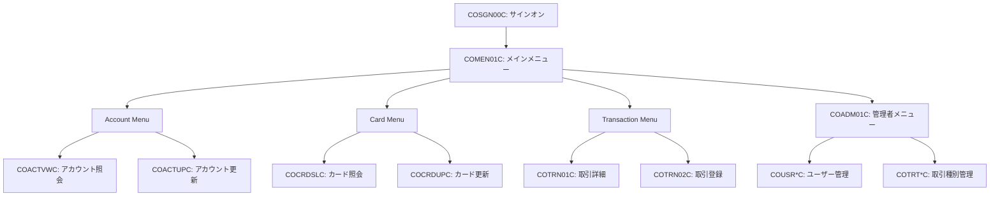

# CardDemo システム 基本設計書（オンライン処理編）

## 1. 概要

本書は、CardDemo システムにおける CICS オンライン処理の詳細を定義します。TN3270 端末を介した画面操作、機能間の遷移、およびユーザーセッションの管理仕様を網羅します。

## 2. 画面遷移図

システムの主要な画面遷移フローを以下に示します。

<!--

-->

## 3. 機能一覧

詳細については、各プログラムの詳細設計書を参照してください。

| 機能グループ | 主要プログラム | 説明 |
| :--- | :--- | :--- |
| 認証・ナビゲーション | `COSGN00C`, `COMEN01C`, `COADM01C` | ログイン、機能選択、管理メニューへの分岐 |
| アカウント管理 | `COACTUPC`, `COACTVWC` | アカウント情報の照会と更新（VSAM: `ACCTDATA`） |
| カード管理 | `COCRDUPC`, `COCRDLIC`, `COCRDSLC` | カード情報のライフサイクル管理（VSAM: `CARDXREF`, `CARDFILE`） |
| 取引管理 | `COTRN00C`, `COTRN01C`, `COTRN02C` | 取引履歴のブラウズと新規取引の受付 |
| ユーザー・保安管理 | `COUSR00C`, `COUSR01C`, `COUSR02C`, `COUSR03C` | システム利用者の管理（VSAM: `USRSEC`） |

## 4. 共通処理仕様

- **COMMAREA**: データ遷移には共通コマエリア (`COCOM01Y`) を使用し、プログラム間でコンテキスト（ユーザーID、現在のアカウントID等）を共有します。
- **BMS (Map)**: `DFHMSD` を用いて定義されたマップセットを使用し、シンボリックマップを介してデータを処理します。
- **入力検証**: 各プログラムの `RECEIVE` 処理後、属性チェック（数値、日付形式等）を実施し、エラー時はブザー音とエラーメッセージでユーザーに通知します。

---
[概要編](file:///Users/inohara/Documents/antigravity-demo/aws-mainframe-modernization-carddemo/docs/BasicDesign.md) | [バッチ処理編](file:///Users/inohara/Documents/antigravity-demo/aws-mainframe-modernization-carddemo/docs/BasicDesign_Batch.md) | [データベース設計編](file:///Users/inohara/Documents/antigravity-demo/aws-mainframe-modernization-carddemo/docs/BasicDesign_Database.md) | [関連システムインターフェース編](file:///Users/inohara/Documents/antigravity-demo/aws-mainframe-modernization-carddemo/docs/BasicDesign_Interface.md) | [運用管理編](file:///Users/inohara/Documents/antigravity-demo/aws-mainframe-modernization-carddemo/docs/BasicDesign_Operations.md)
