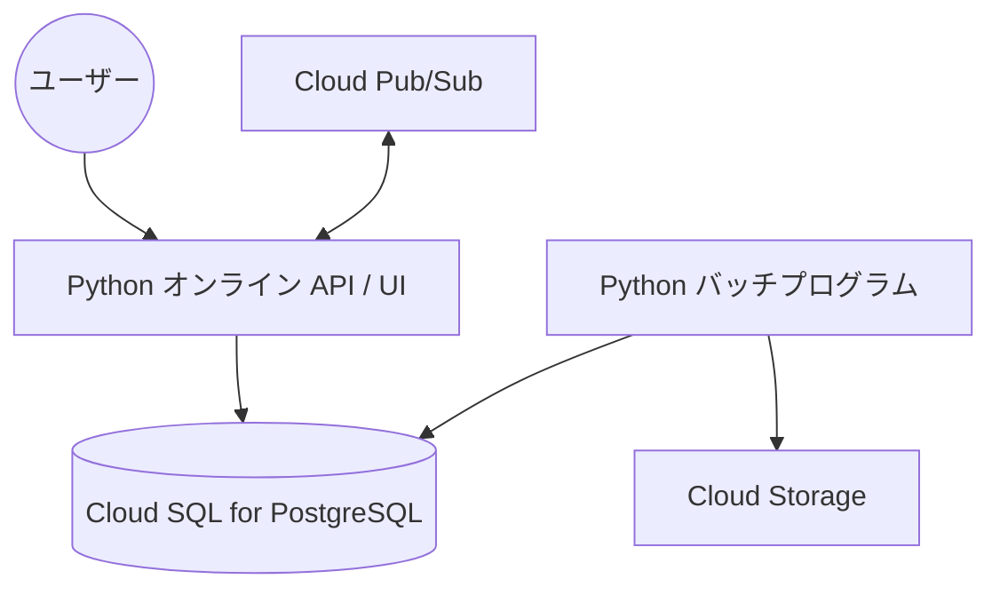

# CardDemo システム 基本設計書（概要編）

## 1. はじめに

本書は、メインフレーム上で稼働していた CardDemo システムを Google Cloud (Python / PostgreSQL / Cloud Pub/Sub) 環境へ移行した後の全体像を定義する「概要編」です。

詳細な設計内容については、以下の各編を参照してください。

- [オンライン処理編](file:///Users/inohara/Documents/antigravity-demo/python-carddemo/docs/p_BasicDesign_Online.md)
- [バッチ処理編](file:///Users/inohara/Documents/antigravity-demo/python-carddemo/docs/p_BasicDesign_Batch.md)
- [データベース設計編](file:///Users/inohara/Documents/antigravity-demo/python-carddemo/docs/p_BasicDesign_Database.md)
- [関連システムインターフェース編](file:///Users/inohara/Documents/antigravity-demo/python-carddemo/docs/p_BasicDesign_Interface.md)

---

## 2. 全体アーキテクチャ

システムは、Python によるアプリケーション層、Cloud SQL によるデータ層、および Cloud Pub/Sub によるメッセージング層で構成されます。

- **オンライン層**: Python (FastAPI/Flask 等) を使用し、以前の CICS オンライン機能をエミュレートまたは現代的な Web インターフェースとして提供します。
- **バッチ層**: Python スクリプトとして実装し、Cloud Scheduler や Workflows などでジョブサイクルを管理します。
- **データ層**: Cloud SQL (PostgreSQL) を使用し、以前の VSAM および DB2 データを統合管理します。
- **メッセージング層**: Cloud Pub/Sub を使用し、以前の MQ によるシステム間連携を置換します。

## 3. 機能体系の概要

### 3.1. オンライン機能

Web ブラウザまたは API クライアントを介して、顧客管理、取引登録、承認フローなどのリアルタイム処理を提供します。

### 3.2. バッチ機能

定期実行またはオンデマンドで動作し、大量取引の反映、利息計算、帳票出力、データ移行を行います。

## 4. データ構造の概要

すべてのデータは PostgreSQL のリレーショナルテーブルとして管理されます。VSAM のキー構造はインデックスおよび制約として定義されます。

---
[オンライン処理編](file:///Users/inohara/Documents/antigravity-demo/python-carddemo/docs/p_BasicDesign_Online.md) | [バッチ処理編](file:///Users/inohara/Documents/antigravity-demo/python-carddemo/docs/p_BasicDesign_Batch.md) | [データベース設計編](file:///Users/inohara/Documents/antigravity-demo/python-carddemo/docs/p_BasicDesign_Database.md) | [関連システムインターフェース編](file:///Users/inohara/Documents/antigravity-demo/python-carddemo/docs/p_BasicDesign_Interface.md)
