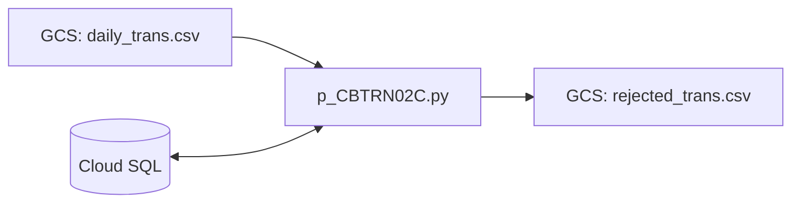

# CardDemo システム 基本設計書（バッチ処理編）

## 1. 概要

本書は、Python を使用して再構築された CardDemo システムのバッチ処理方式を定義します。旧システムの JCL によるジョブ制御と COBOL プログラムによるバッチ処理を、Python スクリプトと Google Cloud のマネージドサービス（Cloud SQL, Cloud Storage）に移行します。

## 2. バッチサイクル (ジョブ管理)

ジョブのスケジューリングと実行制御には、Cloud Scheduler および Cloud Workflows (または Cloud run Jobs) を使用することを想定します。

### 2.1. 日次サイクル (Daily Cycle)

- **主要ジョブ**: `p_POSTTRAN.py` (旧 POSTTRAN.jcl 相当)
- **処理フロー**:
  1. GCS から日次取引 CSV (`daily_trans.csv`) を読込。
  2. 取引テーブル (`transactions`) へのインサート。
  3. アカウントテーブル (`accounts`) の残高更新。
  4. カテゴリ別残高テーブル (`category_balances`) の更新。

### 2.2. 月次サイクル (Monthly Cycle)

- **主要プロセス**: `p_INTCALC.py`, `p_CREASTMT.py`
- **処理フロー**:
  1. `p_INTCALC.py`: 利息・手数料の計算と `transactions` への追記。
  2. `p_CREASTMT.py`: 履歴抽出とステートメント (PDF/HTML) 生成。

## 3. 機能一覧 (Python バッチ)

| カテゴリ | プログラム ID (Python) | 説明 |
| :--- | :--- | :--- |
| 取引反映 | `p_CBTRN01C.py`, `p_CBTRN02C.py` | 日次取引のバリデーションと反映 |
| 財務計算 | `p_CBACT04C.py` | 利息・手数料の計算ロジック |
| 帳票出力 | `p_CBTRN03C.py`, `p_CBSTM03A.py` | レポート生成、ステートメント作成 |
| データ管理 | `p_CBACT01C.py`〜`03C.py` | データの抽出・エクスポート |

## 4. バッチ構成イメージ

## 5. 共通ユーティリティ (Python)

メインフレーム時代のユーティリティは、標準ライブラリや専用の共通モジュールで代替します。

- **日付変換**: `datetime` モジュール。
- **ファイルアクセス**: `google-cloud-storage` ライブラリ。
- **DBアクセス**: `SQLAlchemy` (ORM) または `psycopg2`。

---
[概要編](file:///Users/inohara/Documents/antigravity-demo/python-carddemo/docs/p_BasicDesign.md) | [オンライン処理編](file:///Users/inohara/Documents/antigravity-demo/python-carddemo/docs/p_BasicDesign_Online.md) | [データベース設計編](file:///Users/inohara/Documents/antigravity-demo/python-carddemo/docs/p_BasicDesign_Database.md) | [関連システムインターフェース編](file:///Users/inohara/Documents/antigravity-demo/python-carddemo/docs/p_BasicDesign_Interface.md)
