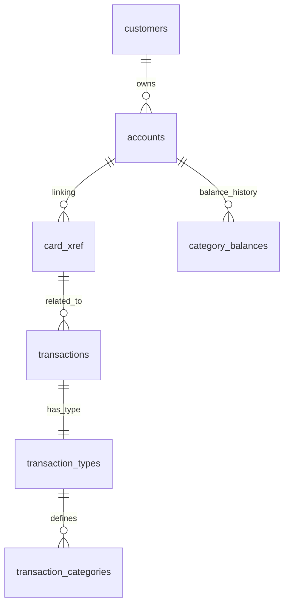

# CardDemo システム 基本設計書（データベース設計編）

## 1. 概要

本書は、Google Cloud (Cloud SQL for PostgreSQL) 上で構築される CardDemo システムのデータモデルを定義します。旧システムの VSAM ファイルおよび DB2 テーブルを PostgreSQL のリレーショナルデータベースに集約します。

## 2. 永続化層の構成

すべてのデータは Cloud SQL for PostgreSQL (db-f1-micro 等の最小構成) に格納されます。

| 旧プラットフォーム | 旧名称 | 新テーブル名 | プライマリキー | 説明 |
| :--- | :--- | :--- | :--- | :--- |
| **VSAM (KSDS)** | `CUSTFILE` | `customers` | `cust_id` | 顧客基本情報 |
| **VSAM (KSDS)** | `ACCTFILE` | `accounts` | `acct_id` | アカウント残高、状態 |
| **VSAM (KSDS)** | `CARDXREF` | `card_xref` | `card_num` | カード番号とアカウント ID の紐付け |
| **VSAM (KSDS)** | `TRNXFILE` | `transactions` | `trn_id` | 取引履歴明細 |
| **VSAM (KSDS)** | `USRSEC` | `users` | `usr_id` | ユーザーログイン資格情報 |
| **VSAM (KSDS)** | `TCATBALF` | `category_balances` | `acct_id`, `type_cd`, `cat_cd` | カテゴリ別残高 |
| **DB2** | `TRNTYPE` | `transaction_types` | `trn_type_cd` | 取引種別定義 |
| **DB2** | `TRNTYCAT` | `transaction_categories` | `trn_type_cd`, `trn_cat_cd` | 取引カテゴリ詳細設定 |

## 3. インフラ構成 (Cloud SQL)

- **エンジン**: PostgreSQL 15 (またはそれ以上)
- **マシンタイプ**: `db-f1-micro` (最小構成)
- **ストレージ**: 10GB (最小構成), ストレージの自動増分を有効化
- **ネットワーク**: プライベート IP 接続を推奨

## 4. データアクセス仕様

- **ORマッパー**: Python 上では `SQLAlchemy` または `Tortoise-ORM` を使用します。
- **ロック制御**:
  - PostgreSQL の行レベルロック (`SELECT ... FOR UPDATE`) を使用し、整合性を担保します。
- **データ型マッピング**:
  - `PIC 9(n)` -> `NUMERIC` または `INTEGER`
  - `PIC X(n)` -> `VARCHAR(n)`
  - `COMP-3` (金額) -> `NUMERIC(15, 2)`

## 5. ER図

---
[概要編](file:///Users/inohara/Documents/antigravity-demo/python-carddemo/docs/p_BasicDesign.md) | [オンライン処理編](file:///Users/inohara/Documents/antigravity-demo/python-carddemo/docs/p_BasicDesign_Online.md) | [バッチ処理編](file:///Users/inohara/Documents/antigravity-demo/python-carddemo/docs/p_BasicDesign_Batch.md) | [関連システムインターフェース編](file:///Users/inohara/Documents/antigravity-demo/python-carddemo/docs/p_BasicDesign_Interface.md)
