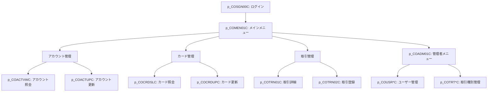

# CardDemo システム 基本設計書（オンライン処理編）

## 1. 概要

本書は、Python を使用して再構築された CardDemo システムのオンライン処理アーキテクチャを定義します。旧システムの CICS オンラインおよび BMS マップによる画面操作を、モダンな Web API または Web アプリケーション構成に移行します。

## 2. API / 画面遷移構造

従来の TN3270 画面遷移をベースに、RESTful API または Web フレームワーク (FastAPI/Flask 等) による機能構成を採用します。

## 3. 機能一覧 (Python モジュール構成)

各プログラムファイルは COBOL 当時の名称に `p_` を付けた Python スクリプトとして実装します。

| カテゴリ | 主要プログラム (Python) | 説明 |
| :--- | :--- | :--- |
| 認証・共通 | `p_COSGN00C.py`, `p_COMEN01C.py`, `p_COADM01C.py` | JWT 等による認証、機能ナビゲーション |
| アカウント管理 | `p_COACTUPC.py`, `p_COACTVWC.py` | アカウント情報の CRUD 処理 (PostgreSQL) |
| カード管理 | `p_COCRDUPC.py`, `p_COCRDLIC.py`, `p_COCRDSLC.py` | カード情報の属性管理 |
| 取引管理 | `p_COTRN00C.py`, `p_COTRN01C.py`, `p_COTRN02C.py` | 取引履歴の検索・表示、新規受付 |
| ユーザー管理 | `p_COUSR00C.py`〜`p_COUSR03.py` | システム利用者のプロファイル管理 |

## 4. 共通処理仕様

- **セッション管理**: Redis または PostgreSQL をバックエンドとしたステートレスなセッション管理（JWT トークン等）を推奨します。
- **データバリデーション**: `Pydantic` 等を使用して入力値の検証を行い、メインフレーム時代の属性チェック（数値、形式等）を継承します。
- **データアクセス**: SQLAlchemy を介して PostgreSQL へアクセスします。

---
[概要編](file:///Users/inohara/Documents/antigravity-demo/python-carddemo/docs/p_BasicDesign.md) | [バッチ処理編](file:///Users/inohara/Documents/antigravity-demo/python-carddemo/docs/p_BasicDesign_Batch.md) | [データベース設計編](file:///Users/inohara/Documents/antigravity-demo/python-carddemo/docs/p_BasicDesign_Database.md) | [関連システムインターフェース編](file:///Users/inohara/Documents/antigravity-demo/python-carddemo/docs/p_BasicDesign_Interface.md)
